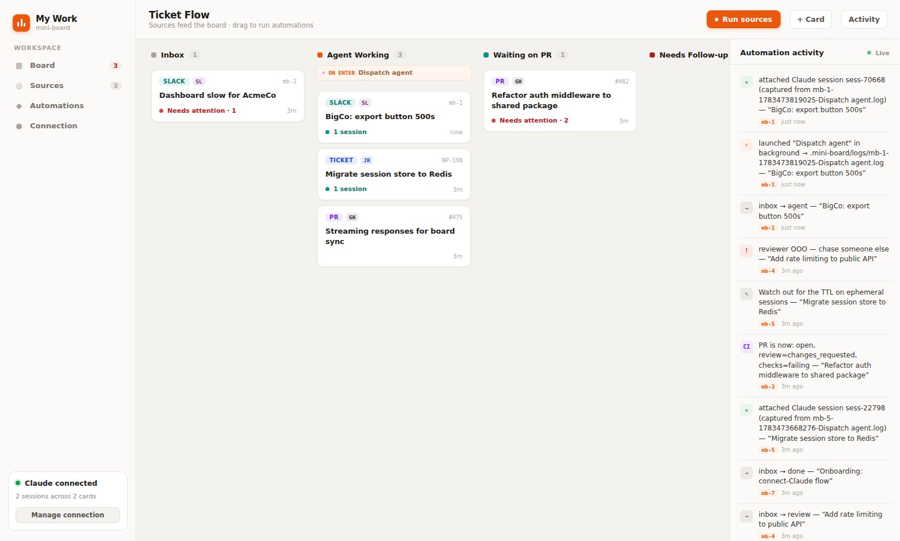
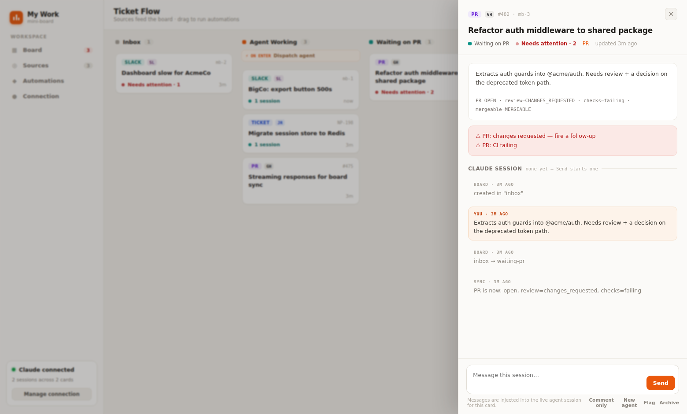
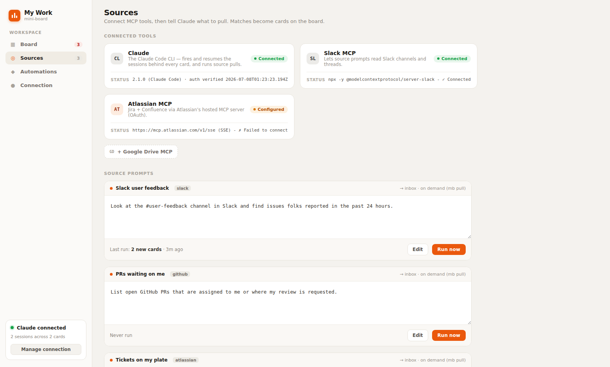

# mini-board

A tiny, YAML-driven sprint board for one person drowning in agent-assisted work. It tracks
**PRs, tickets, Slack asks, and loose tasks** through a lifecycle you define, **calls out what
needs your attention**, fires **actions when cards move between columns** (launch a Claude agent,
run a script), and keeps a per-card trail of **Claude session ids** so you can always fire a
follow-up into the right conversation.

Two files, both yours, both greppable, both git-trackable:

| File | Who writes it | What it is |
|---|---|---|
| `board.yml` | you | Drives the board: columns, swimlanes, attention rules, actions. |
| `state.yml` | the tool | The cards: refs, column, sessions, flags, full activity log. |



## The problem it solves

> Someone posts an ask on Slack → I fire off an agent to tackle it → it opens a PR → I lose track
> of it → it's waiting on the PR → I come back, need to fire follow-ups because it didn't get it
> fully right → eventually get someone to review and merge it → then I need to follow up, move it,
> maybe run automation testing… I'm not sure what's going on.

Each of those steps is a **column**. Losing track is the **attention engine's** job to prevent.
Firing the agent and the follow-ups are **actions** — triggered by dragging a card or by
`mb comment --fire`. The PR's real state comes in via **`mb sync`** (the `gh` CLI), which also
auto-moves cards when PRs merge or close.

## Install

```bash
git clone https://github.com/fabioelia/mini-board && cd mini-board
npm install && npm link        # gives you `mini-board` and the short alias `mb`
```

Requirements: Node ≥ 20. Optional: [`gh`](https://cli.github.com/) (authenticated) for PR sync,
[`claude`](https://code.claude.com/) for the agent actions.

## Quickstart

```bash
mkdir ~/my-board && cd ~/my-board
mb init                       # writes board.yml + state.yml
$EDITOR board.yml             # set defaults.repo etc.

mb add "Slack ask: dashboard timeout for BigCo" --slack https://acme.slack.com/archives/C1/p123
mb add "Fix auth mock flakiness" --pr 4321 --ticket NP-1234

mb                            # render the board in the terminal
mb move 1 agent               # drag it into "Agent Working" → launches a Claude agent
mb sync                       # pull live PR state, harvest session ids, raise attention
mb attention                  # what needs me right now?
mb web                        # drag-and-drop web board at http://localhost:4400
```

## The lifecycle, end to end

The default `board.yml` ships with columns matching the flow above — rename/reorder freely:

`inbox → agent → waiting-pr → follow-up → review → merged → done`

1. **Slack ask arrives.** `mb add "…" --slack <thread-url>`. It lands in **Inbox**, which has
   `attention: true` — it shows up in `mb attention` until you triage it.
2. **Fire an agent.** `mb move <card> agent` (or drag it in the web UI). The column's `on_enter`
   action launches `claude -p` **in the background** with the card's full context — title, refs,
   recent activity — and `capture_session: true` harvests the new **session id** from the agent's
   JSON output onto the card.
3. **It opens a PR.** Attach it to the card — `mb set <card> --pr 4321` (or a full URL) — and
   move it to **waiting-pr**. Then stop thinking about it. That's the point.
4. **You lose track. The board doesn't.** `mb sync` stamps live PR state onto the card. Changes
   requested? CI failing? Merge conflict? Sitting untouched past the column's `stale_after`?
   → it's in `mb attention` with the reason spelled out.
5. **Fire follow-ups.** `mb comment <card> "the tests fail on the EU cluster — check region config" --fire`
   resumes the card's **latest Claude session** with your comment. (Or hit **Fire to session ⚡**
   in the web drawer.) Not sure the old session has the right context? `mb agent <card> "…"`
   starts a fresh one — the card keeps the whole session trail either way.
6. **Review & merge.** `stale_after: 48h` on **review** nudges you to chase reviewers. When the PR
   merges, the next `mb sync` **auto-moves** the card to **merged** (configurable via
   `sync.auto_move`) — whose `on_enter` can kick off your E2E script, a verification agent, whatever.
7. **Done.** `mb move <card> done`, then `mb archive <card>` when you never want to see it again.

## Connectors: wiring up a blank board

A fresh board leads with **connector tiles** — the things sources need before they can pull
(`mb connect` in the terminal, or the Sources panel on the web board, which auto-opens when the
board is empty):

| Tile | What it is | Setup |
|---|---|---|
| **Claude** | The Claude Code CLI — fires/resumes every card's sessions and runs source pulls. | Install it, log in once, then prove it end-to-end: `mb connect claude --verify` (runs a real tiny headless call). |
| **Slack MCP** | Lets prompts read Slack channels/threads. | `mb connect slack` (needs `SLACK_BOT_TOKEN` + `SLACK_TEAM_ID` exported). |
| **Atlassian MCP** | Jira + Confluence via Atlassian's hosted MCP (OAuth). | `mb connect atlassian`, then complete OAuth via `/mcp` inside `claude`. |
| **Google Drive MCP** | Search/read Drive files. | `mb connect gdrive` (Google OAuth on first run). |

Status is probed from reality (`claude --version`, `claude mcp list`) and cached in `state.yml`:
**●** connected · **◐** configured but not connected/verified · **○** not set up. Every setup
command is just a default — override any tile (or add new ones, e.g. Sentry) under `connectors:`
in `board.yml`.

## Sources: prompts that pull cards onto the board

A **source** is a configurable prompt plus a tool allowlist plus a target column:

```yaml
sources:
  - id: slack-feedback
    title: Slack user feedback
    prompt: "Look at the #user-feedback channel in Slack and find issues folks reported in the past 24 hours."
    tools: [slack]
    column: inbox
  - id: my-prs
    prompt: List open GitHub PRs assigned to me or where my review is requested.
    tools: [github]
```

`mb pull` (or the tile's **Pull now** button) wraps the prompt in a harness that tells Claude:
what board this is, **every card already on it** (so it self-dedupes), and the exact JSON card
contract it must answer with — `{"cards": [{title, type, pr, ticket, slack, note, dedupe_key}]}`.
The run executes as `claude -p … --output-format json --allowedTools <only the source's tools>`,
and the response is validated, **deduped again on ingest** (by `dedupe_key` per source and by
PR/ticket/Slack ref), and turned into cards in the source's column — each stamped with
`origin: {source, key}` and the scan's session id recorded on the source.

Tool names map to allowlists: `slack`/`atlassian`/`gdrive` → their MCP servers, `github` → the
`gh` CLI, `web` → web search — or pass any raw pattern like `mcp__sentry`. Pulls are synchronous
in the CLI (`--bg` for background) and always background from the web UI; finished background
pulls are ingested the next time anything reads the board. Editing sources in the web UI writes
them back to `board.yml` surgically — your comments survive.

## Claude sessions: the model

A card is **not** one Claude session. Every headless `claude -p` run is a new session, and even
`claude --resume <id>` mints a *new* session id for the continued conversation. So cards carry a
**list**:

```yaml
sessions:
  - { id: 6f9a…, label: captured from mb-4-…-on_enter:agent.log, at: 2026-07-08T09:14:02Z }
  - { id: 88c1…, label: captured from mb-4-…-fire_comment.log,   at: 2026-07-08T13:40:51Z }
```

- Actions with `capture_session: true` harvest ids automatically from the agent's
  `--output-format json` output (background runs are harvested next time any command runs).
- `mb comment --fire` always resumes the **latest** session.
- Got a session id from somewhere else (an interactive run, claude.ai/code)? Attach it:
  `mb session <card> <session-id> --label "interactive debugging"`.

## `board.yml` reference

```yaml
board:
  name: My Work
  group_by: type          # swimlanes: type | project | none

defaults:
  repo: acme/widgets      # lets --pr be a bare number
  ticket_url: https://acme.atlassian.net/browse/   # for `mb open <card> ticket`

columns:
  - id: agent
    title: Agent Working
    attention: true       # every card here is always called out (triage columns)
    stale_after: 4h       # call out cards with no activity for 4h (m/h/d/w)
    on_enter:             # actions fired when a card moves IN (on_leave: moves out)
      - run: claude -p {{prompt}} --output-format json
        background: true          # don't block; output → .mini-board/logs/
        capture_session: true     # harvest the session_id from the output

sync:
  auto_move:              # `mb sync` moves cards when their PR changes state
    pr_merged: merged
    pr_closed: done

actions:                  # named actions (override the built-in defaults)
  fire_comment:           # used by `mb comment --fire`
    run: claude --resume {{card.session}} -p {{message}} --output-format json
    background: true
    capture_session: true
  new_agent:              # used by `mb agent`
    run: claude -p {{prompt}} --output-format json
    background: true
    capture_session: true
```

**Action templates** may use `{{card.id}}`, `{{card.title}}`, `{{card.pr}}`, `{{card.ticket}}`,
`{{card.slack}}`, `{{card.session}}` (latest), `{{card.context}}` / `{{prompt}}` (a full
agent-ready digest of the card), `{{message}}` (the comment), `{{from}}` / `{{to}}` (the move).
Values are **shell-escaped for you — never add your own quotes** around a placeholder. Prefer env
vars in scripts? The same values arrive as `$MB_CARD_ID`, `$MB_PR`, `$MB_SESSION`, `$MB_MESSAGE`, …

Actions are plain shell commands and run with your credentials — treat `board.yml` like you treat
your shell config, and use `--dry-run` on `mb move` / `mb comment --fire` to preview the exact
command before trusting a new one.

## CLI reference

```text
mb init [dir]                    scaffold board.yml + state.yml
mb [board]                       render the board in the terminal
mb add "Title" [--type pr|ticket|slack|task] [--pr <url|repo#N|N>]
               [--ticket <key>] [--slack <url>] [--col <column>]
               [--project <p>] [--session <id>] [--note "…"]
mb move <card> <column>          move a card (fires on_leave/on_enter actions)
                                 [--no-actions] [--dry-run] [--comment "…"]
mb set <card> [--pr <url>] [--ticket <key>] [--slack <url>]
              [--title "…"] [--project <p>] [--type <t>]
mb comment <card> "text"         log a comment; --fire sends it into the latest Claude session
mb agent <card> ["instruction"]  launch a NEW Claude session with the card's full context
mb session <card> <session-id>   attach a session id  [--label "…"]
mb show <card>                   full detail: refs, PR state, sessions, activity
mb attention                     everything that needs you right now (alias: todo)
mb sync [card] [--no-move]       pull live PR state via gh; auto-move merged/closed
mb connect [id] [--check]        connector tiles: status / set one up
mb connect claude --verify       prove Claude auth with a real tiny run
mb sources                       list sources + their last runs
mb pull [source] [--bg|--dry-run] run source prompts through Claude; ingest JSON cards
mb sessions                      every Claude session across all cards
mb flag <card> "reason"          manually mark a card; mb unflag <card> clears
mb open <card> [pr|ticket|slack] open a ref in the browser
mb list [--col <column>]         flat list        mb archive <card>   hide a card
mb web [--port 4400]             the drag-and-drop web board
```

Cards are addressed by id (`mb-3`), bare number (`3`), or any unique title substring (`auth`).

## The web board

`mb web` serves a local, zero-build UI (implementing the `Swimlane Board` Claude Design mockup —
source in `docs/design/`) with four views behind a sidebar:

- **Board** — lanes with accent dots and **⚡ ON ENTER** automation chips, drag-and-drop moves
  that fire the same actions as `mb move` (with a dark "Automation fired" toast), per-card status
  (needs attention / agent working / CI running / sessions), and a live **Automation activity**
  rail built from every card's log.
- **Sources** — connected-tool cards with real probe status, dashed add-tiles for missing
  connectors, and one editable prompt card per source with **Run now** and last-run results.
- **Automations** — every column's `on_enter`/`on_leave` actions as lane-to-lane rule cards.
- **Connection** — Claude status with **Verify auth** / **Re-check**, run stats, and every
  captured session (click one to jump to its card).

Clicking a card opens the **drawer**: type/source chips, attention reasons, PR state, and the
card's history rendered as a session transcript — your comments, automation runs (dark tool
style), syncs, and source events. The composer at the bottom **messages the live session**
(`comment --fire`; starts a fresh agent when the card has no session yet), with quiet secondary
actions for comment-only, new agent, flag, and archive. State on disk stays the source of truth:
the CLI and the web UI can be used side by side.






## Attention: what gets called out, and why

- **Column rules** — `attention: true` (always) and `stale_after` (no activity for too long).
- **PR reality** (after `mb sync`) — changes requested · CI failing · merge conflict ·
  approved-but-unmerged · merged/closed while the card is in the wrong column.
- **Manual flags** — `mb flag <card> "waiting on Auth0 support"`.
- **Agent breadcrumbs** — background agent logs pending session capture.

Everything shows in `mb attention`, on the board header, and as red badges in the web UI. Reasons
are computed live from state — nothing to un-stick.

## Development

```bash
npm test        # node:test suite — store, attention rules, actions/session capture, PR sync
```

No build step; plain ES modules. The only dependency is [`yaml`](https://eemeli.org/yaml/).
